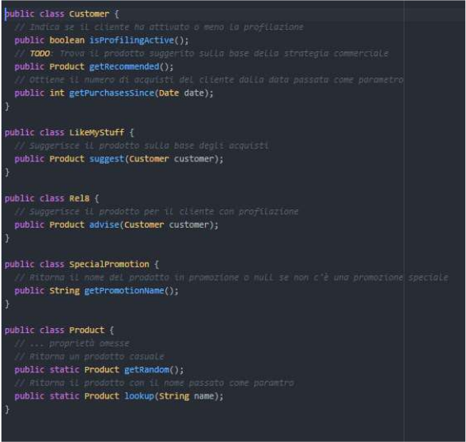

##Risposta quesito 6
Ho implementato la soluzione 1 il cui flusso è riportato nel file [quesito6.pdf](quesito6.pdf). Il file presenta anche una seconda interpretazione possibile del problema ma ho preferito adottare la prima soluzione poichè sembrava quella più affine alla richiesta del quesito.

Per lo sviluppo della soluzione ho adottato il linguaggio **TypeScript**.

Ho riportato le classi come mostrato dalla figura allegata al quesito 6 e ho realizzato l'implementazione della funzione ```getRecomandation()``` della classe *Customer*




Per eseguire i test mi sono avvalso di un finto database che potete trovare nel file [MockDB.ts](./bin/mock/MockDB.ts). Ho ipotizzato che le risorse degli acquisti effettuati siano locali e non remote, eliminado così l'attesa per il loro download.
Con una implementazione che fa uso di database SQL o NoSQL ci si può avvalere delle query sul DB per selezionare solo ciò di cui si ha bisogno o per contare il numero di acquisti effettuati nell'ultimo anno.

Per eseguire il test è possibile clonare questa repository e successivamente installare le dipendenze contenute nel file *package.json* attraverso il comando ```npm install```.

Attraverso il comando ```npm test``` verrà lanciata la batteria di test sulla funzione ```getRecomandation()``` per ogni customer nel DB. I customer sono strutturati in modo da coprire tutti i casi d'interesse.

La libreria che utilizzo per eseguire i test è [mocha](https://mochajs.org/). Se non dovesse essere disponibile nel pc, è necessario installarla globalmente attraverso il comando ```npm i -g mocha```

Durante l'esecuzione del test si può notare come alcuni task abbiano delle attese superiori ai 100ms, in questi casi sto simulando l'attesa che potrebbe essere generata dall'utilizzo di *Rel8* immaginandolo come un servizio (microservizio) ospitato su cloud e che magari faccia uso di una IA per ricavare il prodotto da suggerire e quindi con dei tempi di attesa per il responso.  
